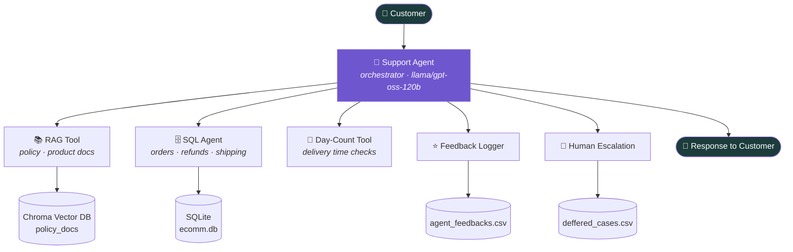

<div align="center">

# 🤖 Agentic Support System

**A modular, multi-agent e-commerce support bot built with LangChain — RAG, Text-to-SQL, and tool-orchestration working together to handle real customer conversations.**


</div>

---

## 💡 What is this?

Most "AI support bot" demos are a single prompt bolted onto an FAQ file. This project is a **team of agents** instead: a support agent that decides what a customer actually needs, then delegates to specialists — a policy-grounded RAG agent, a natural-language-to-SQL agent for order data, and a set of action tools for logging feedback and escalating to a human.

It's built to mirror how a *real* support workflow works: gather only what's needed, answer confidently when you have grounding, and hand off gracefully when you don't.

---

## 🧠 How it works



**The flow, in plain English:**
1. A customer message comes in.
2. The **Support Agent** decides: is this a product/policy question, an order question, or something out of scope?
3. It calls the right tool — RAG for grounded policy/product answers, the SQL sub-agent for order/refund/shipping lookups — and can chain several tools per turn.
4. If it can't confidently resolve the query within its guardrails, it **defers to a human** rather than guessing.
5. At the end of the conversation, it logs a rating via the **feedback tool** for continuous evaluation.

---

## ✨ Features

| | |
|---|---|
| 🧩 **Multi-agent orchestration** | A top-level tool-calling agent routes between specialist sub-agents instead of one giant prompt trying to do everything |
| 📚 **Retrieval-Augmented Generation** | Answers product & policy questions grounded in a persisted ChromaDB vector store — cites sources, refuses to hallucinate |
| 🗄️ **Text-to-SQL agent** | Turns natural-language questions ("where's my order?") into safe, read-only SQL queries against a live order database |
| 🙋 **Human-in-the-loop escalation** | Knows its own limits — logs a structured handoff (customer, intent, reason) instead of bluffing |
| ⭐ **Feedback capture** | Every resolved conversation ends with a rating, logged for future evaluation |
| 🔁 **Resilient by design** | Exponential-backoff retries around LLM calls to absorb rate limits and transient API errors |
| 🗂️ **Versioned prompts & configs** | Prompts and model settings live in `prompts/` and `configs/` as versioned artifacts (`v1.txt`), not buried in code |

---

## 🏗️ Project structure

```
Agentic-Support-System/
├── configs/                  # Per-agent model + tool configuration (JSON)
│   ├── rag_agent.json
│   ├── sql_agent.json
│   └── support_agent.json
├── prompts/                  # Versioned system prompts
│   ├── rag_agent/v1.txt
│   ├── sql_agent/v1.txt
│   └── support_agent/v1.txt
├── src/
│   ├── agent/workflow.py     # Orchestrator — builds & runs the support agent
│   ├── sources/llm.py        # LLM client setup (Groq via LangChain)
│   ├── tools/
│   │   ├── rag_tool.py       # Policy/product Q&A over ChromaDB
│   │   ├── sql_tool.py       # Natural-language → SQL sub-agent
│   │   ├── daycount_tool.py  # Delivery day-count calculator
│   │   ├── feedback_tool.py  # Logs customer feedback + rating
│   │   └── deffered_tool.py  # Logs human escalations
│   └── config.py             # Central config/paths loader
├── Database/                 # ecomm.db (SQLite) + policy_docs (ChromaDB)
├── Storage/                   # Feedback logs, deferred cases, chat history
├── Notebooks/                 # Exploratory notebooks for each component
└── requirements.txt
```

---

## 🚀 Getting started

```bash
# 1. Clone the repo
git clone https://github.com/YS-Pundir/Agentic-Support-System.git
cd Agentic-Support-System

# 2. Create a virtual environment
python -m venv .venv
source .venv/bin/activate      # Windows: .venv\Scripts\activate

# 3. Install dependencies
pip install -r requirements.txt

# 4. Add your API key
echo 'api_key="your-groq-api-key-here"' > .env

# 5. Run the chatbot
python -m src.main
```


---

## 💬 Example conversation

```
Chatbot: Hey, how can I help you?
You: hi, I want to know your refund policy
Chatbot: You're eligible for a full refund within 30 days of delivery,
         minus a small cancellation fee. Refunds are processed to your
         original payment method within 5–7 business days.
         Source: policy_docs/refund_policy.md

You: also, where's my order #482?
Chatbot: Could you confirm the email or customer ID linked to that order?
You: john@example.com
Chatbot: Order #482 was shipped on Nov 24 and is currently marked
         "Delayed." Would you like me to escalate this to a human agent?
```

---

## ⚙️ Configuration model

Each agent (`rag_agent`, `sql_agent`, `support_agent`) has its own versioned prompt + config, so you can iterate on one agent without touching the others:

```json
{
  "support_agent": {
    "v1": {
      "prompt_path": "prompts/support_agent/v1.txt",
      "config": { "model": "openai/gpt-oss-120b", "temperature": 0.0 }
    }
  }
}
```

Swapping models, tweaking temperature, or A/B testing a `v2` prompt is a config change, not a code change.

---

## 🗺️ Roadmap / known limitations

Being upfront about what's next — this is an active learning project, not a finished product:

- [ ] Enforce customer-data isolation at the **query layer**, not just the prompt layer, for the SQL tool
- [ ] Wire `max_tool_steps` / `tools` fields in `configs/*.json` into the actual agent executors
- [ ] Add conversation history truncation (`max_messages`) to cap token growth on long chats
- [ ] Move from print-based CLI to a lightweight API/UI (FastAPI or Streamlit)
- [ ] Add unit tests for each tool (day-count edge cases, SQL agent, RAG retrieval)
- [ ] Trim `requirements.txt` to actual runtime dependencies

---

## 🛠️ Tech stack

`LangChain` · `LangGraph` · `Groq (Llama 3.1 / GPT-OSS)` · `ChromaDB` · `Sentence-Transformers` · `SQLite` · `Pandas` · `Tenacity`

---

## 📄 License

MIT — see [`LICENSE`](LICENSE) for details.

<div align="center">

*Built as part of a BSc Software Engineering project — feedback and PRs welcome.*

</div>
